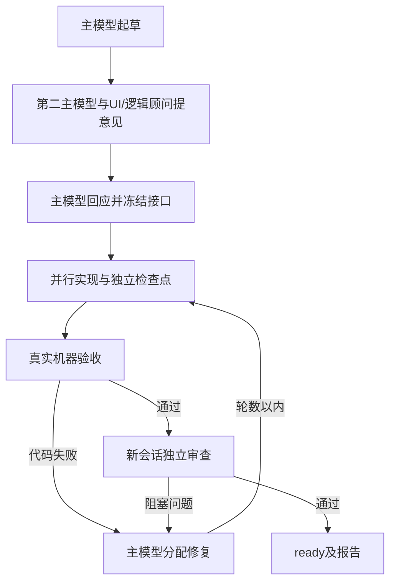

# SkillCrew 0.2 · 可恢复的 AI 开发小队

当前版本：**0.2.0-alpha.2**。

输入一句需求，主模型制定计划，副模型并行实现，执行器负责文件归属、实际测试、独立审查和最多两轮定向修复。当前项目类型：**新建 React + TypeScript + Vite 本地待办应用**。

## 新增能力

- **一键流程**：`build` 串联规划、冻结接口、实现、验收、审查和修复。终端显示进度，最终结果是 JSON。
- **断点续跑**：`resume` 复用已成功的规划回合和通过门禁的 worker 交付。单个模型失败不丢掉另一方的成功结果。
- **定向修复**：测试失败或审查出现 high 问题时，主模型给对应文件所有者分派任务。默认最多两轮，修复后重新执行全部机器验收及独立审查。
- **模型调度**：默认自动安排两个不同的主模型，其余任务按角色能力分配；支持手动指定。开始前展示实际分工，报告记录选择依据与候选不足时的说明。
- **Skill 调度**：内置 5 个专项 Skill，按角色和阶段注入；支持显式登记本地 Skill。内容快照及哈希随计划冻结。

## 快速运行

解压后在本包目录使用 Node.js 24+。已包含编译好的执行器，运行它不需要先安装本包开发依赖。

创建 `request.json`：

```json
{"request":"做一个支持拖拽、分类和本地保存的待办应用。"}
```

```powershell
node bin/skillcrew.mjs build --request-file request.json --out ./todo-app --state-dir ./crew-state --verification local
```

返回的 `id` 是运行 ID；只有 **ready** 表示全部交付门禁通过。需要继续时：

```powershell
node bin/skillcrew.mjs resume <运行ID> --state-dir ./crew-state
node bin/skillcrew.mjs status <运行ID> --state-dir ./crew-state
node bin/skillcrew.mjs report <运行ID> --state-dir ./crew-state
```

恢复时沿用原模型、Skill、验收环境及修复上限。创建时用 `--max-repairs 0` 关闭自动修复，或选择 `1` / `2`；resume 不能重置这些设置。

### 环境

- 已登录的 **agycli（命令 `agy`）** 与 Codex CLI；执行时只要求实际选用的 provider 可启动。无需 Gemini CLI 或 Claude Code CLI。
- 默认验收环境为 Docker。省略 `--verification local` 时需要运行中的 Docker。
- 本机验收需要 npm 和 Playwright 1.55.1 对应的 Chromium；在临时副本执行生成代码，是普通本机进程。
- `doctor --verification local` 检查工具。Windows 使用原生 `.exe`，避免 `.cmd` 参数拼接。

非标准路径可配置：

```powershell
$env:SKILLCREW_AGY_BIN = 'C:\Tools\agy\agy.exe'
$env:SKILLCREW_CODEX_BIN = 'C:\Tools\codex\codex.exe'
$env:SKILLCREW_NPM_CLI = 'C:\Tools\node\node_modules\npm\bin\npm-cli.js'
```

浏览器安装可在 `examples/generated-todo` 内运行 `npm ci --ignore-scripts`、`npx playwright install chromium`。不要在正在生成的输出目录里安装依赖。环境修复后，用 `check <运行ID> --state-dir ./crew-state --verification local` 复验原交付，然后 `resume`。

## 主副模型如何合作



默认 `--lead-mode auto`，优先选两个不同的可用主模型：第一主模型负责规划和最终裁决，第二主模型独立检查架构与验收遗漏，意见交给第一主模型收敛。只有一个合适候选时自动使用单主模型并说明原因；`--lead-mode single` 强制单主，`--lead-mode dual` 要求双主，候选不足则报错。worker 每轮可通过结构化问题请求一次澄清；需要更改冻结接口时停止。

## 模型选择

通过 `/skillcrew` 启动时，Agent 在本会话首次使用前提供一次选择：

- **默认自动分配（推荐）**：从可用且已配置的候选中，选能力评分靠前的主模型和第二主模型；UI、逻辑等任务交给合适的副模型。
- **手动指定模型**：显示可用型号，由你指定所需角色；其余角色可以继续自动分配。

如果本会话已说过选择，就直接沿用；续跑沿用原分工。选择后展示“谁负责什么”再执行，无需反复确认。命令行没有交互提问，省略模型参数即自动选择。Agent 的选择入口由宿主对话提供。

```powershell
node bin/skillcrew.mjs route
```

本机可用池满足条件时，默认角色偏好如下：

| 角色 | 首选 | 工作 |
| --- | --- | --- |
| 主模型 | Codex / `gpt-6-astra`，max | 规划、关键澄清、修复裁决 |
| 第二主模型 | agy / `claude-opus-4-6-thinking` | 独立架构意见、检查验收遗漏 |
| UI | agy / `gemini-3.8-flash-high` | 页面、样式、交互 |
| 逻辑 | Codex / `gpt-6-sol` | 状态、存储、业务逻辑 |
| 独立审查 | agy / `claude-opus-4-6-thinking` | 新会话检查验收遗漏 |

agy 候选来自实时 `agy models`；Codex 来自已安装 CLI 的模型缓存，缓存可能过期。agy 还会核验调用返回的模型 ID；Codex JSONL 没有该字段，观察值保留为未知。调用失败后不会悄悄替换已冻结模型。

`build`、`init` 和 `route` 使用相同的自动发现与选择逻辑；`--discover` 保留兼容，已不必填写。主模型和第二主模型必须不同，手动指定的角色优先保留。副模型按任务评分选择；若与主模型共用型号，会明确说明并通过独立调用执行。独立审查总是新会话。

模型目录示例：[examples/routing.json](examples/routing.json)，用 `--routing-file PATH` 指定。角色值是 **0–100 的产品偏好**，不冒充榜单成绩。可选 `benchmark` 包含 HTTPS `source`、`checkedAt`、各角色 `scores`；60 天以前的分数忽略。有分数时按 30% 偏好 + 70% 评测分数排序，否则按偏好。UI/逻辑模型至少有 5 次本地交付记录才加入失败率惩罚，最多减 20 分。这是协议交付可靠性，不能当作代码质量证明。

评测可参考 [Arena WebDev](https://arena.ai/leaderboard/code/webdev) 和 [Artificial Analysis](https://artificialanalysis.ai/leaderboards/models)。角色映射及分数归一化由配置维护者判断；此版没有自动抓取榜单或引入未知模型。运行报告记录选择依据。

显式指定角色，仍须通过候选可用性检查：

```powershell
node bin/skillcrew.mjs build --request-file request.json --out ./todo-app --verification local --primary-model agy/claude-opus-4-6-thinking --ui-model codex/gpt-6-sol
```

可用 `--co-lead-model provider/model` 指定第二主模型；只指定第二主模型时，第一主模型自动选其他合适候选。`--lead-mode single` 与 `--co-lead-model` 冲突时会报错。冻结后的运行不会因默认策略更新而重新分配模型。

没有 Codex 缓存时，用 `--inventory-file PATH` 提供 `{"agy":["模型ID"],"codex":["模型ID"]}`。这是用户声明的候选池，不是服务端核验。

## Skill 登记与安装

```powershell
node bin/skillcrew.mjs skills
node bin/skillcrew.mjs build --request-file request.json --out ./todo-app --verification local --skills-file examples/skills.json
```

清单示例：[examples/skills.json](examples/skills.json)。每项包含 `id`、相对清单文件的 `path`、`roles` 和 `phases`。角色：`primary/co_lead/ui/logic/review`；阶段：`plan/implement/repair/review`。

Skill 创建时读取并保存快照；修改原文件只影响新运行。执行器按阶段分配指令，不执行附带脚本，也不增加模型文件或工具权限。

安装到 agycli：

```powershell
node scripts/install.mjs --project 'C:\Projects\my-workspace'
```

安装到 `.agents/skills/skillcrew/`，内含独立执行器。在该项目启动 `agy` 后使用 `/skillcrew 做一个支持拖拽、分类和本地保存的待办应用`。`--user` 使用个人目录；安装器拒绝覆盖已有版本，升级时可先保留旧安装或选择新项目。`--host claude` 仅改变宿主安装位置。

## 恢复与交付保护

- UI 槽位仍名为 `gemini`：仅 `src/ui/**`、`src/styles/**`；逻辑槽位 `codex`：仅 `src/core/**`。槽位与 provider 分离。
- worker 返回结构化完整文件；执行器验证整批路径、实际差异、体积和符号链接。接口、依赖、测试不可修改。
- 检查点绑定输入、冻结接口、完整 Route 和交付内容；被改动的检查点不能复用。
- 候选及回滚目录位于输出旁的 `.skillcrew-<运行ID>-<轮次>/`；状态目录与输出可在不同磁盘。任务仍在恢复时请保留这些事务目录。
- 输出出现人工改动会停止。新增 `.git`、`node_modules` 等不由执行器管理的根级目录也会停止替换，原文件保持原位。
- 只回收确认已退出的同主机进程锁；其他主机、权限不足、旧版无主机信息的锁不会自动删除。
- 状态目录须支持硬链接（本次使用 NTFS）。锁先写完整记录再原子发布，恢复进程的死锁也可回收。旧版空锁或超过 8 层的异常恢复链会明确报出路径；确认所有相关进程均已退出后，可将这些锁改名保留，再重试。
- ready 要求安装、类型检查、构建、至少 6 项单元测试、2 项浏览器测试及无 high 问题的独立审查。模型文字不能覆盖机器失败。

记录在 `<state-dir>/runs/<运行ID>/`，包括规划缓存、Skill 快照、每轮输入/交付、机器结果、审查问题、修复裁决和报告。达到修复上限时保留证据并停止。

## 范围与验证

固定待办模板仍是首版范围；尚未接管已有仓库、后端、登录、部署或任意技术栈。没有自动计费预算控制，也未证明多模型必然比单模型更快或更省。新版恢复保证适用于 0.2 创建的运行；0.1 失败记录建议保留并新建运行。

开发：`npm ci`、`npm test`。实际验证及限制见 [VALIDATION.md](VALIDATION.md)，可运行示例见 [DEMO.md](DEMO.md)。

## 开源协议

SkillCrew 使用 [MIT License](LICENSE)。Copyright (c) 2026 0d000721-ui。

允许使用、修改、分发及商用，分发时须保留版权声明和许可文本。第三方依赖遵循各自的许可证。
